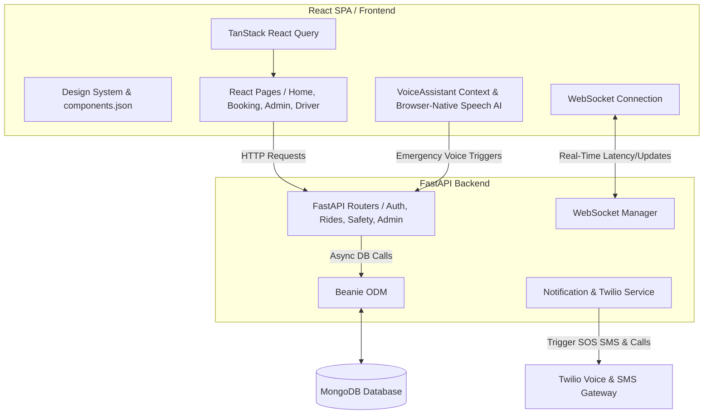

# 🛡️ SafeGo: Ride Safety Platform & Design System

> A premium, high-fidelity, and safety-centric ride-sharing application designed to provide dynamic ride modes, real-time telemetry, hands-free voice assistance, and instant emergency escalation.

SafeGo combines a modern, premium web frontend built on **React, TypeScript, and TailwindCSS** with a robust, asynchronous **FastAPI** backend backed by **MongoDB and Beanie ODM**. The platform is engineered specifically to champion accessibility, passenger safety, and high-fidelity real-time coordination.

---

## 🏗️ Architecture Overview

SafeGo utilizes a decoupled client-server architecture designed for real-time telemetry, low latency, and modern safety-oriented integration.



### 1. High-Fidelity Client (Frontend)
- **Framework & Tooling**: [React 18](https://react.dev/) scaffolded via [Vite](https://vitejs.dev/) and powered by [TypeScript](https://www.typescriptlang.org/).
- **Design System & Styling**: Implemented with Vanilla CSS variables and [TailwindCSS](https://tailwindcss.com/) for fluid transitions, animations, and unified styling tokenization. Built using premium design practices (glassmorphism, subtle micro-animations, theme toggling, and layout responsiveness).
- **Core Dependencies**:
  - **Framer Motion**: Smooth entry layouts and animated transitions.
  - **TanStack React Query**: Automated state synchronizations and clean client-side caching.
  - **React Router DOM (v6)**: Seamless path routing and code-split dynamic imports (`React.lazy`).
  - **Recharts**: High-fidelity dashboard widgets and interactive passenger-driver analytics.

### 2. High-Performance API Gateway (Backend)
- **Framework**: [FastAPI](https://fastapi.tiangolo.com/) (Python) executing asynchronous event loops for maximum network throughput.
- **Asynchronous ODM**: [Beanie](https://beanie-odm.dev/) utilizing [Motor](https://motor.readthedocs.io/) under the hood to manage [MongoDB](https://www.mongodb.com/) without blocking backend operations.
- **State & Connection Protocol**:
  - **REST API**: Standard endpoints for auth, user data, booking workflows, and administrative commands.
  - **WebSockets**: Bi-directional channels facilitating live-location relays and telemetry updates.

### 3. Integrated Services & Third-Party Gateways
- **Twilio Integrated Safety**: Automatic SMS dispatch (with coordinates and live map links) and emergency interactive voice calls placed automatically to the user's custom emergency contacts.
- **Language Localization (i18n)**: Highly configurable multi-language translation architecture.

---

## 🌟 Core Feature Suite & How It Works

### 🚖 1. Dynamic Ride Modes
Passengers can tailor their transportation experience based on specific safety and physical requirements:
*   🟢 **Normal Mode**: Standard premium ride-hailing experience.
*   🌸 **Pink Mode**: Custom ride safety portal catering exclusively to women passengers, highlighting certified women drivers and safety telemetry.
*   ♿ **PWD (Disabled Accessible) Mode**: Fully accessible layout optimized for screen readers, keyboard navigation, and wheelchair-certified vehicle dispatching.
*   🟠 **Elderly Mode**: High-contrast, large-typography design simplified for older citizens, ensuring simple workflows and prioritized safety call check-ins.
*   🟣 **Premium Mode**: Deluxe executive travel options utilizing luxury vehicle categories.

### 🎙️ 2. Native AI Voice Assistant
Integrated via the browser's speech-recognition interface (`VoiceAssistantProvider`), passengers have hands-free controls while on the move. By talking naturally, a user can:
- Query their active ride status.
- Trigger instant hands-free SOS alarms using a distress keyword.
- Share live location coords to their emergency network.

### 🚨 3. Real-Time Emergency SOS Escalation
When an SOS is activated (either manually through the animated SOS button or via Voice Assistant):
1.  **Backend Registry**: The system registers a critical `SOSAlert` document tied to the active ride.
2.  **Emergency Contact Notification**: The backend retrieves all pre-configured primary contacts and concurrently:
    - Sends an SMS via Twilio with a direct Google Maps tracking link.
    - Fires an automated voice phone call to establish direct vocal warnings.
3.  **Command Center Alert**: The administrative panel triggers high-priority audio alarms and renders the live-tracking coordinates on the map.

### 📊 4. Integrated Portals & Control Panels
*   **Administrative Command Center**: Oversees active rides, real-time location histories, driver audits (license and vehicle approval), safety performance statistics, and live SOS alert management.
*   **Driver Portal**: Seamless driver-partner onboarding with document upload, shift status switching (online/offline tracking), ride accept/reject prompts, and earnings analytics.

---

## 📁 Repository Structure

```
safego-design-system/
├── backend/                  # FastAPI backend codebase
│   ├── app/                  # Main server application
│   │   ├── models/           # Beanie ODM models (User, Ride, Driver, SOSAlert)
│   │   ├── routes/           # API Endpoints (Auth, Safety, WebSocket, Voice, Admin)
│   │   ├── services/         # Core business logic (Twilio Notification system)
│   │   ├── utils/            # Helper modules (Cryptography, authorization, dependencies)
│   │   └── main.py           # Base initialization, routers, and CORS middleware
│   ├── alembic/              # Database migration versioning (optional)
│   ├── requirements.txt      # Python package manifest
│   └── run_backend.bat       # Script to launch backend server instantly
├── src/                      # React frontend codebase
│   ├── components/           # Reusable components (SOSButton, ThemeToggle, MapPlaceholder)
│   │   ├── ui/               # Core design elements (dialog, toast, cards, buttons)
│   │   └── admin/            # Specialist administrative telemetry views
│   ├── contexts/             # Global contexts (VoiceAssistantContext, ThemeContext)
│   ├── pages/                # High-fidelity pages (Booking, Safety, Home, Admin, PWDMode)
│   ├── locales/              # Language dictionaries (En/Filipino translations)
│   ├── lib/                  # Utilities (Tailwind merge configurations)
│   └── App.tsx               # Main routing map & provider wrapper
├── public/                   # Public static media assets
├── index.html                # Vite client entry page
├── tailwind.config.ts        # Styling tokens & utility configuration
└── components.json           # Shadcn UI configuration mapping
```

---

## ⚡ Setup & Installation

### Prerequisites
*   [Node.js](https://nodejs.org/) (v18.x or higher)
*   [Python](https://www.python.org/) (v3.10 or higher)
*   [MongoDB](https://www.mongodb.com/) (Running locally or an active Atlas connection string)

### 1. Backend Configuration
1. Navigate into the backend directory:
   ```bash
   cd backend
   ```
2. Create and configure your `.env` file from the example:
   ```bash
   cp .env.example .env
   ```
3. Set your custom environment values:
   - `MONGO_URI`: Your MongoDB connection string.
   - `TWILIO_ACCOUNT_SID`, `TWILIO_AUTH_TOKEN`, `TWILIO_PHONE_NUMBER`: Twilio integration keys (optional but required for live SMS/Calls).
4. Run the automated runner script:
   ```bash
   run_backend.bat
   ```
   *Alternatively, create a python virtual environment, install `requirements.txt` via `pip install -r requirements.txt`, and start the app:*
   ```bash
   uvicorn app.main:app --reload
   ```

### 2. Frontend Configuration
1. Return to the root workspace directory.
2. Install frontend dependencies:
   ```bash
   npm install
   ```
3. Boot up the Vite developer server:
   ```bash
   npm run dev
   ```
4. Access the web app in your browser at `http://localhost:5173`.

---

## 🛡️ Safety & Data Standards
- **Token Security**: Stateful operations use secure JWT bearer validation alongside client-side encryption.
- **Telemetry History**: Ride tracking location data (`RideLocationHistory`) is soft-deleted or archived to protect passenger privacy post-ride completion.
- **Accessibility**: Developed in compliance with WCAG 2.1 AA accessibility guidelines, specifically for screen readers, high contrast, and navigation usability.
